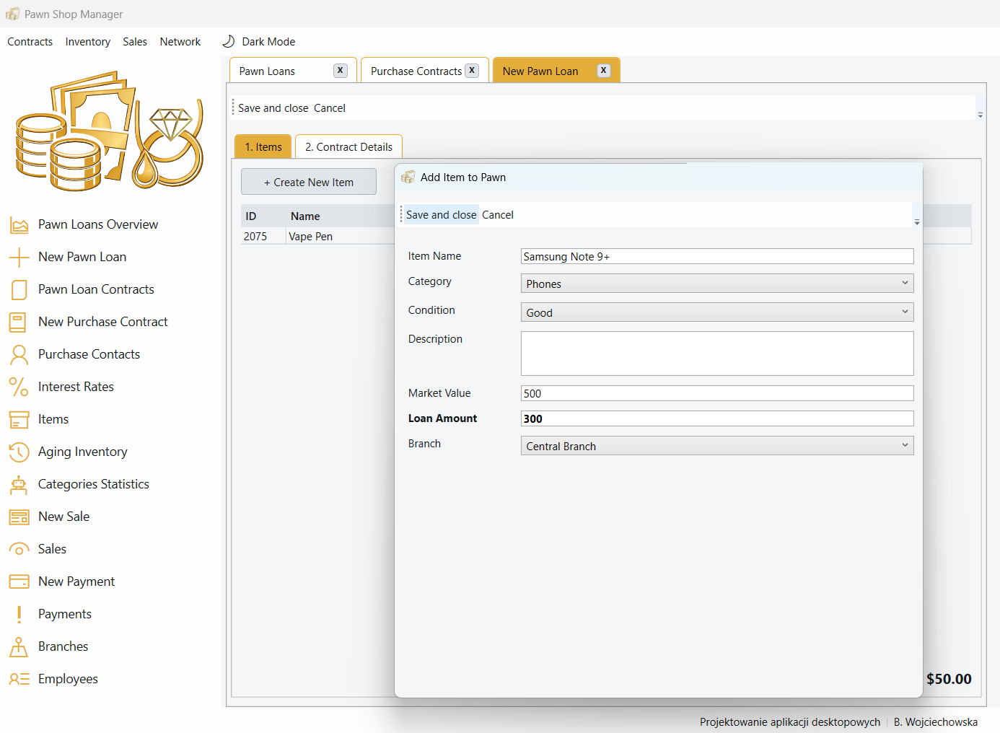
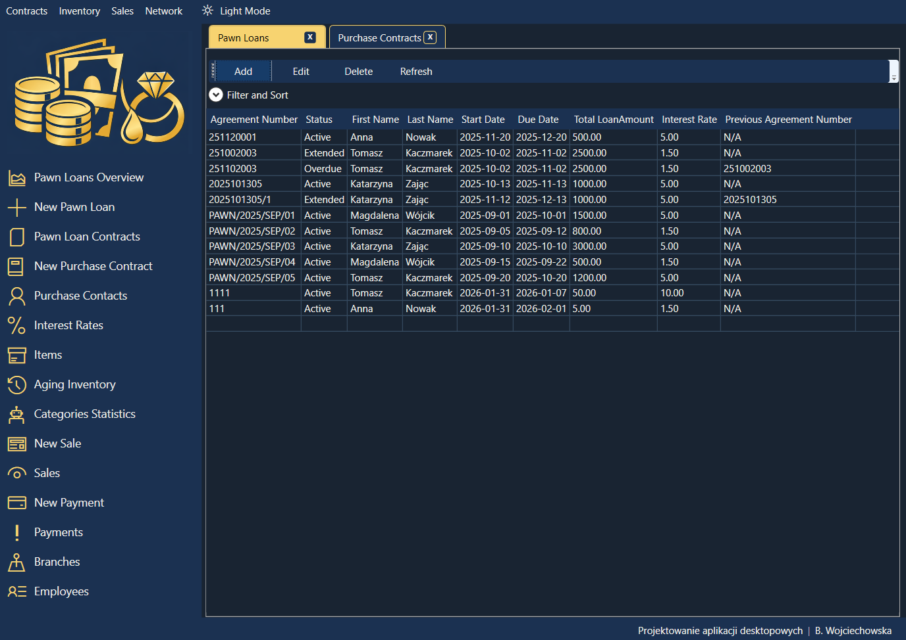

# 🏢 Pawn Shop Manager 🏢
## (WPF & MVVM)

> **Note:** This is an advanced university project developed for the "Business Desktop Applications Programming" course. You might notice the internal C# namespace is named `MVVMFirma` - this is a legacy naming convention from the initial academic template.

A comprehensive desktop application designed to manage the daily operations of a Pawn Shop. Built with **C#**, **WPF**, and **Entity Framework**, the project heavily focuses on clean architecture, adhering strictly to the **MVVM (Model-View-ViewModel)** design pattern and Object-Oriented Programming principles.

## Tech Stack
* **Language:** C# (.NET)
* **UI Framework:** WPF (Windows Presentation Foundation) & XAML
* **Architecture:** MVVM (Model-View-ViewModel)
* **ORM:** Entity Framework (LINQ to Entities)
* **External Libraries:** MVVM Light Toolkit (`GalaSoft.MvvmLight.Messaging`)

## Architectural Highlights (Why look at this code?)

While the business logic is simplified for academic purposes, the codebase demonstrates advanced architectural patterns expected in enterprise applications:

* **Generic Base ViewModels:** To strictly follow the DRY (Don't Repeat Yourself) principle, the project implements abstract, generic base classes like `AllViewModel<T>` and `OneViewModel<T>`. These handle repetitive CRUD operations, validation, sorting, and searching across all entities.
* **Separation of Concerns:** Business logic (like loan calculations, interest, and summaries) is strictly separated from ViewModels into dedicated Business classes (e.g., `PawnLoanSummaryB`).
* **Decoupled Communication:** Navigation and view interactions are handled via the MVVM Light `Messenger` class, ensuring ViewModels never have direct references to Views.
* **Advanced LINQ Queries:** Data is fetched and projected into dedicated DTOs (Data Transfer Objects like `PawnLoanForAllView`) using complex LINQ queries, joining multiple tables and handling nullable foreign keys.
* **Audit Trail Integration:** Overridden save commands automatically trigger `createRecordHistory()` to maintain a log of who created records and when.

## Key Features

* **Dynamic Theming (Dark/Light Mode):** The application features a fully functional Dark/Light mode toggle. This is achieved using dynamic XAML Resource Dictionaries and `DynamicResource` bindings, ensuring a smooth and professional user experience.
* **Pawn Loans Dashboard:** A dynamic reporting module that allows users to filter pawn agreements by Date Ranges and Contract Statuses to calculate Total Loans, Total Interest, and Estimated Collateral.
* **Data Grids with Filtering:** Built-in generic sorting and searching capabilities for managing clients, items, and contracts.
* **Business Validation:** A dedicated `BusinessValidator` class ensures data integrity (e.g., validating percentages, future dates, and non-zero values) before any database operations occur.
* **Custom Control Templates:** Reusable XAML styles and Control Templates ensure a consistent UI across all dynamic tabs and views.

## How to run locally
1. Clone the repository.
2. Open the solution `.sln` in **Visual Studio**.
3. Update the Connection String in the `App.config` file to point to your local SQL Server instance.
4. (Optional) Run Entity Framework Migrations or attach the provided SQL database script to recreate the schema.
5. Build and Run!

> 
> 